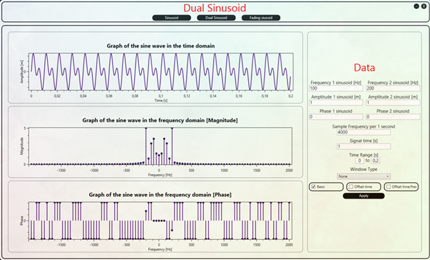
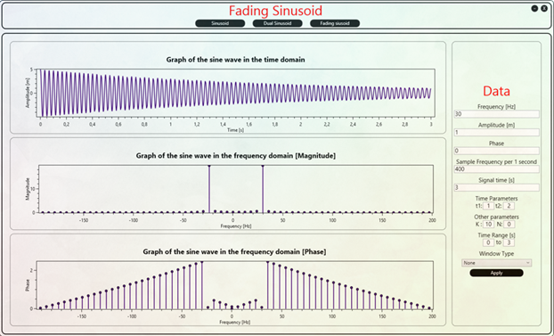

# 📊 Sinusoid Visualization App

A desktop application built with **C# (.NET, WPF)** that visualizes sinusoidal signals.  
It supports **basic sine waves, dual sine combinations, fading signals, and custom signals**, allowing users to explore signal properties interactively.  

---

## ✨ Features
- 📈 **Basic Sinusoid**: visualize amplitude, frequency, and phase  
- ➕ **Sum of Sine Waves**: combine and analyze two sinusoids  
- 📉 **Fading Sinusoid**: simulate amplitude decay over time  
- 🎛️ **Custom Signals**: create and visualize custom combinations  
- 🎨 **Interactive WPF GUI** with charts and real-time updates  
- 🧩 **MVVM architecture** for clean separation of logic and UI  

---

## 📂 Project Structure
```
Sin_sumSin_fadingSin_visualization_app-master/
│── ebsis_3.sln                # Visual Studio solution
│── ebsis_3/                   # Main project
│   ├── App.xaml               # WPF entry
│   ├── Models/                # Signal models
│   ├── Repositories/          # Signal repositories
│   ├── View/                  # XAML views (GUI)
│   ├── ViewModel/             # MVVM logic
│   ├── Images/                # UI assets
│   └── Properties/            # Project metadata
```

---

## ⚙️ Requirements
- **.NET Framework 4.7.2+** (or .NET 5/6 if migrated)  
- **Visual Studio 2019/2022** with WPF workload  

---

## 🔧 Build & Run
1. Open solution:
   ```bash
   ebsis_3.sln
   ```
   in Visual Studio.  

2. Restore NuGet packages:
   ```bash
   dotnet restore
   ```

3. Build and run:
   ```bash
   dotnet build
   dotnet run
   ```

---

## 🖼️ Screenshots
<p align="center">
  
    
</p>

---

## 🛠️ Development
- Language: **C#**  
- Framework: **.NET / WPF**  
- Pattern: **MVVM (Model-View-ViewModel)**  

---
